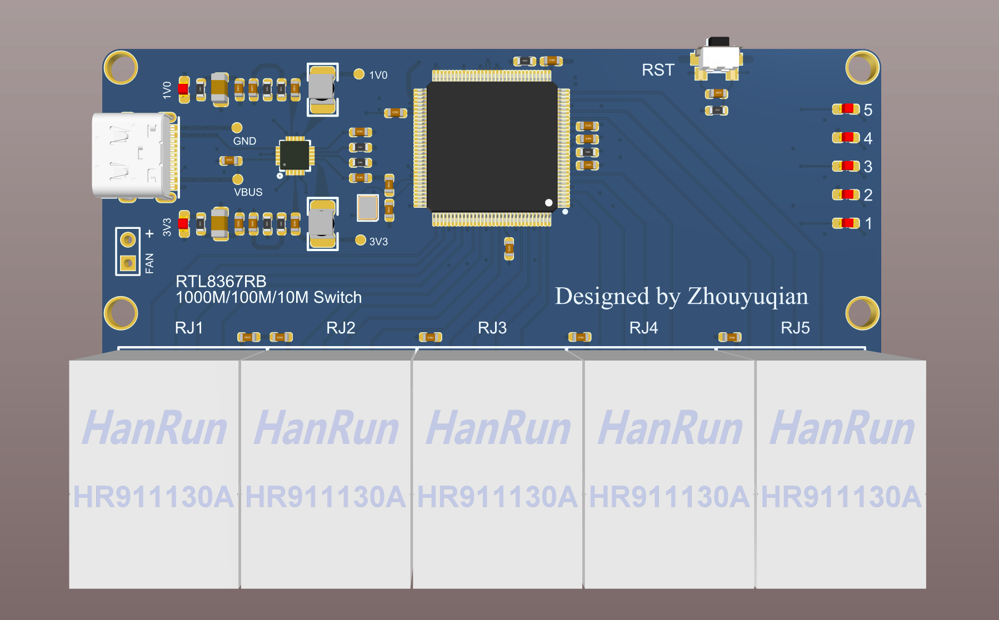

# GE-Switch

基于 RTL8367RB 的 5 口千兆交换机。

体积很小巧，PCB 大小 54x81mm，4 层板；主要元件采用 0603 封装，方便手工焊接；网口使用 HanRun 的 HR911130A 千兆网口，自带隔离变压器；Type-C 供电。

> 留个坑，最近没时间做了。

## ToDo

- [x] Schematic 
- [x] Layout
- [ ] PCB 打样
- [ ] 焊接测试
- [ ] 外壳

## Reference：

[Kirito 实用5口千兆交换机](https://www.oshwhub.com/Kirito/shi-yong-5kou-qian-zhao-jiao-hua)

[稚晖君 GE-Switch](https://github.com/peng-zhihui/GE-Switch)

## License

[GPL-3.0](https://github.com/Starrynightzyq/GE-Switch/blob/master/LICENSE)